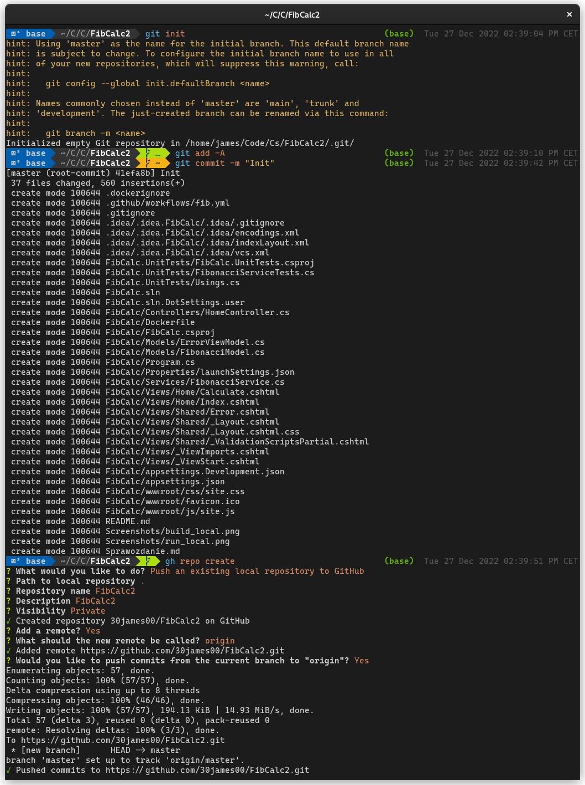
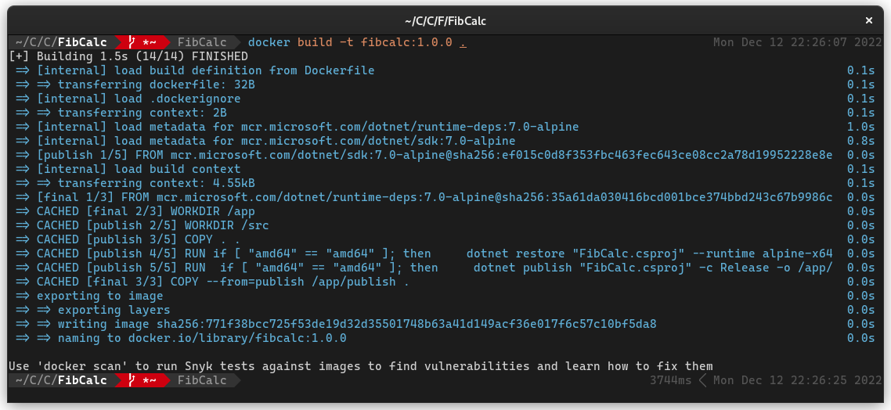
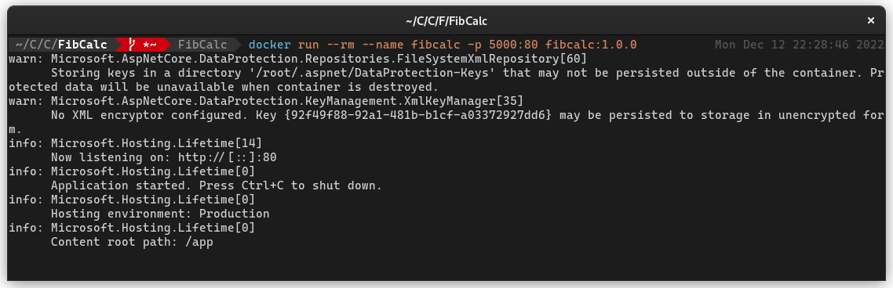
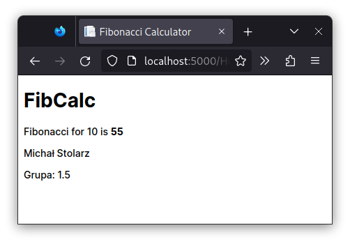
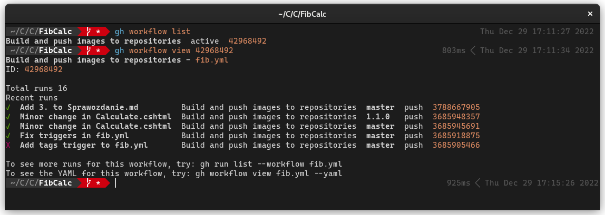
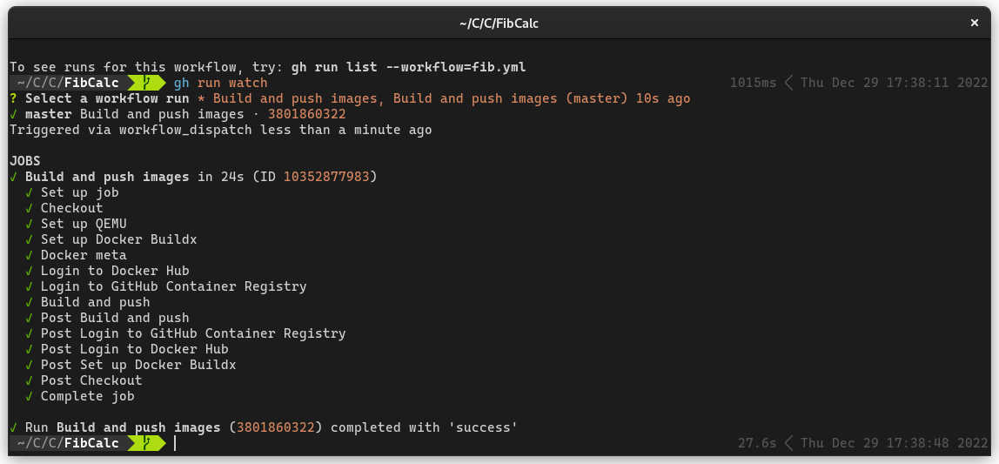
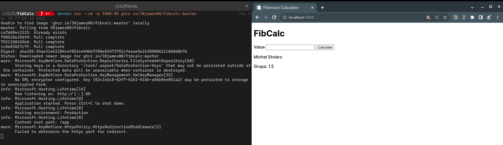
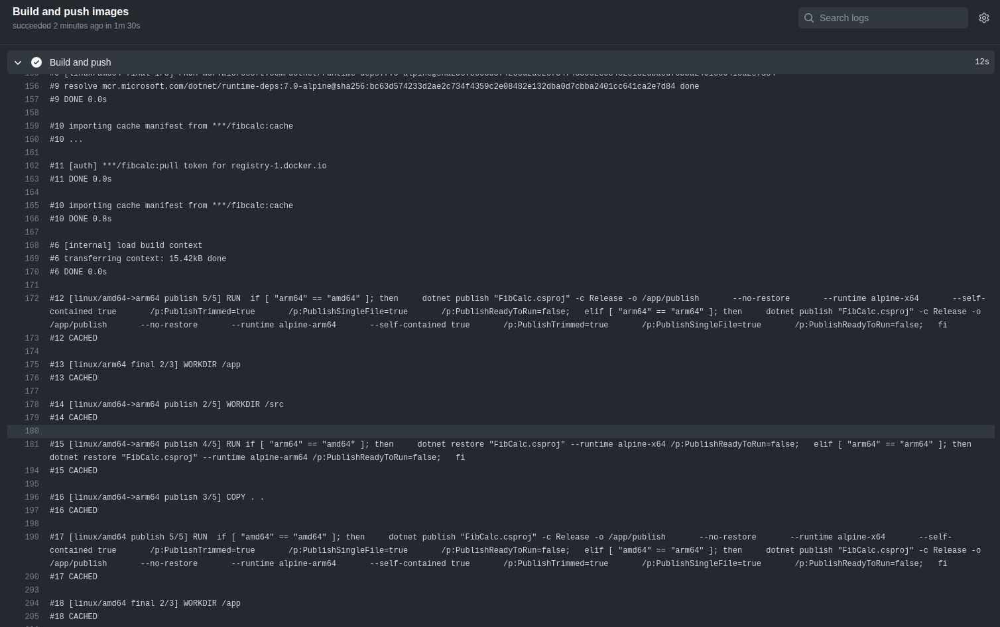
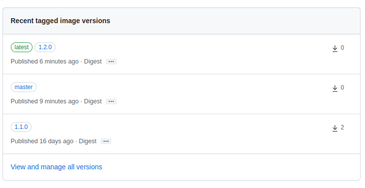

# Zadanie nr 1

## Część obowiązkowa

### 1.

Aplikacja została wykonana w .NET. Jest to prosta aplikacja MVC z formularzem, do którego wprowadzamy numer elementu
ciągu i który zwraca stronę z obliczonym elementem ciągu.

Do wyliczania wartości elementu ciągu został wykorzystany prosty algorytm oparty o programowanie dynamiczne.

Aby stworzyć środowisko pracy na GitHub wykorzystano następujące polecenia:

```shell
git init
git add -A
git commit -m "Init"
gh repo create
```

Rezultat wykonania polecenia:


### 2.

#### A

[Plik Dockerfile](FibCalc/Dockerfile)

* Wykorzystane budowanie wieloetapowe
* Obraz zbudowany przy użyciu domyślnego Dockerfile dla .NET zajmował 212 MB.
* Wykorzystano lekkie obrazy .NET bazujące na Alpine oraz skorzystano z możliwości budowania obrazów `self-contained`, a
  także zmieniono ustawienia .NET pozwalające na dalsze zmniejszenie rozmiaru obrazu (np. wyłączenie tworzenia obrazów
  ready-to-run). Pozwoliło to zmiejszyć rozmiar obrazu do 42 MB.

Źródła:

* [Optimizing for size - dotnet-docker](https://github.com/dotnet/dotnet-docker/tree/d8dc00685a45b7f534e9f68ded50667023ded151/samples/aspnetapp#optimizing-for-size)
* [Trim self-contained deployments and executables](https://learn.microsoft.com/en-us/dotnet/core/deploying/trimming/trim-self-contained)
* [How to build smaller and secure Docker Images for .NET](https://www.thorsten-hans.com/how-to-build-smaller-and-secure-docker-images-for-net5/)

#### B

Budowanie obrazu lokalnie: `docker build -t fibcalc:1.0.0 . `

Rezultat wykonania polecenia:  


#### C

Uruchomienie aplikacji lokalnie: `docker run --rm --name fibcalc -p 5000:80 fibcalc:1.0.0`

Rezultat wykonania polecenia:  


Działająca aplikacja:  


### 3.

[Plik fib.yml](.github/workflows/fib.yml)

W celu generowania tagów zgodnie z specyfikacją SemVer dodano trigger uruchamiający workflow przy pushu nowego tagu na
repozytorium. Action `docker/metadata-action@v4`, gdy triggerem jest branch dodaje tag `latest` i tag zgodny z nazwą
branchu, natomiast gdy triggerem jest tag tworzony jest tag latest oraz tag zgodny z SemVer. Przy tagu SemVer
skorzystano z wzorca `{{version}}`, który tworzy nazwy w formacie `major.minor.patch` z pominięciem prefixu `v`.

W celu wykorzystania repo `ghcr.io` ponownie wykorzystano Action `docker/login-action@v2` tym razem nie do zalogowania
się do Docker Hub a właśnie do GitHub Container Registry. Aby obrazy były wysyłane na `ghcr.io` w
Action `docker/metadata-action@v4` ustawiono nazwę obrazu z podaniem domeny `ghcr.io`. Dzięki temu
Action `docker/build-push-action@v3` umieszcza obrazy w poprawnym repo.

### 4.

#### A

```shell
gh workflow list
gh workflow view <workflow_number>
```

Rezultat wykonania polecenia:


#### B

```shell
gh workflow run <workflow_number>
gh run watch
```

Rezultat wykonania polecenia:


#### C

Uruchomienie obrazu z GitHub Container Registry:  
`docker run --rm -p 5000:80 ghcr.io/30james00/fibcalc:master`

Rezultat wykonania polecenia:


Dowód na poprawne działanie cache - ładowanie z Docker Hub i późniejsze użycie do budowania:



Dowód na poprawne działanie tagowania obrazów zgodnie z SemVer:



## Część nieobowiązkowa

### Zadanie nieobowiązkowe 1

### Zadanie nieobowiązkowe 2
